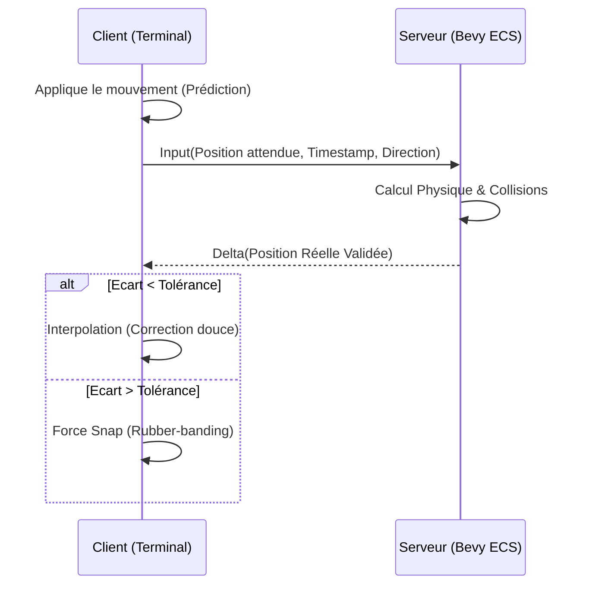
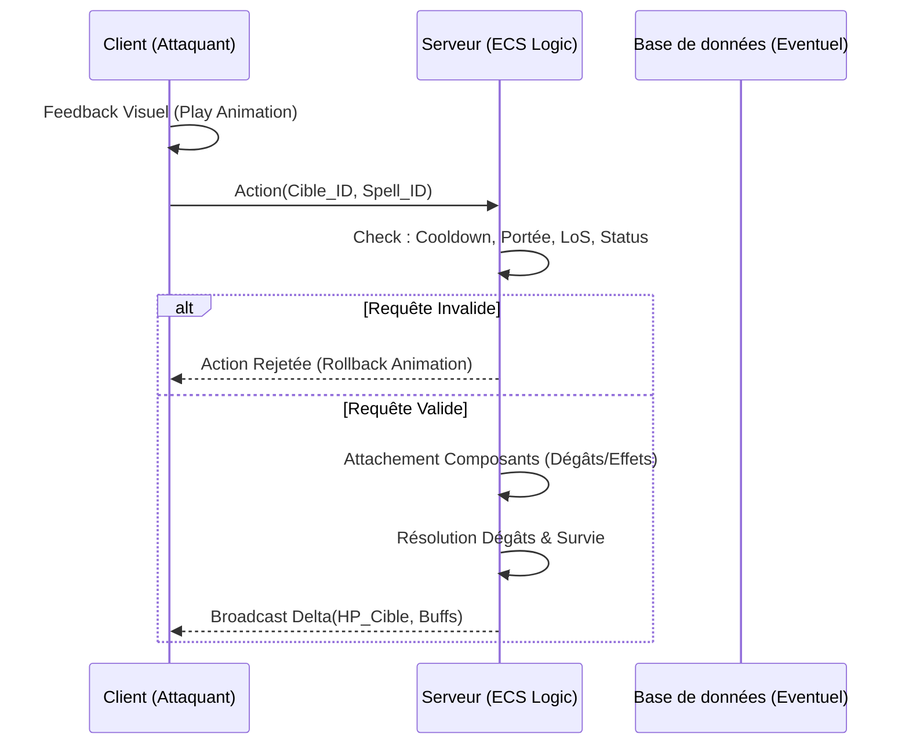
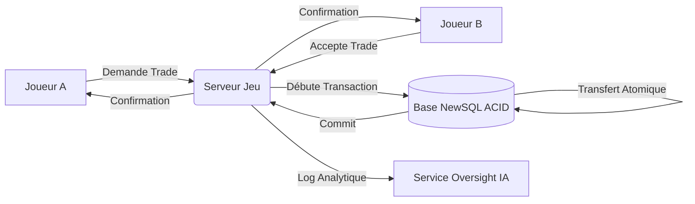

# Document d'Architecture et de Conception Système : Projet "Horizon 2030"

**Version :** 1.1
**Statut :** En cours de révision
**Périmètre :** Conception conceptuelle et intégration des systèmes de jeu
**Public cible :** Architectes, Lead Developers, Tech Leads

---

## Résumé Exécutif (Executive Summary)

Ce document établit la vision conceptuelle de haut niveau pour l'intégration des systèmes fondamentaux d'un MMORPG au style "retro-compatible" (rendu PS2/Metin2), reposant sur une ingénierie ultra-moderne ("Horizon 2030").

Le paradigme architectural central exige une autorité stricte du serveur, s'appuyant sur l'architecture ECS (Entity Component System via **Bevy**) en Rust pour la simulation temps réel. Le client est rétrogradé au statut de "terminal stupide" (Dumb Terminal), ne gérant que le rendu polymorphe (WGPU) et la prédiction graphique. La persistance et l'économie sont assurées par des garanties transactionnelles strictes (PostgreSQL / NewSQL), tandis que les intelligences artificielles (LLM) sont orchestrées de manière sécurisée (Sandboxing) via le protocole MCP, appuyées par un stockage vectoriel sémantique.

---

## 1. Architecture Globale et Paradigme Client/Serveur

L'infrastructure dissocie entièrement la simulation logique de la représentation graphique :
- **Serveur (Headless ECS) :** Détenteur unique de la vérité. Effectue les calculs intensifs (Data-Oriented Design) sans surcharge visuelle.
- **Client (Terminal WGPU) :** Reçoit des mutations d'état (Deltas), affiche le rendu localement, et émet des "Intentions" (Inputs) sans pouvoir décisionnel métier.
- **Réseau (Event-Driven) :** Échanges asynchrones massifs, regroupant le trafic en zones d'intérêt (Spatial Partitioning).

---

## 2. Déplacement et Positionnement

Le système de mouvement repose sur un modèle de **Dead-reckoning** (Prédiction locale) adossé à une **Réconciliation Autoritaire** côté serveur.

### Principes :
1. **Intention immédiate :** Le client initie le mouvement localement pour assurer une réactivité sans latence perçue (Fluidité).
2. **Validation Serveur :** Le client envoie un vecteur d'intention. Le serveur calcule la trajectoire réelle selon le moteur physique (Collisions, limitations de vitesse).
3. **Réconciliation douce :** Le serveur diffuse le vecteur réel validé. Si l'écart entre le client et le serveur dépasse un seuil de tolérance (Snap Threshold), le client corrige son état via une interpolation linéaire (Lerp) ou un téléport (Rubber-banding).



---

## 3. Combat et Résolution des Compétences

La logique d'affrontement (et d'utilisation des compétences) s'inscrit dans un flux strictement transactionnel et événementiel, régi par le principe du **Data-Oriented Design**.

### Principes :
1. **Émission d'Intention :** Le client lance l'animation d'attaque (Feedback immédiat) et transmet l'intention d'action ciblée.
2. **Validation Déterministe (ECS) :** Le serveur vérifie l'intégrité de la requête : portée spatiale, état vivant de la cible, alignement des Line of Sight (LoS), et synchronisation des temps de recharge (Cooldowns).
3. **Application des Modificateurs :** Les compétences ne sont pas des objets instanciés, mais des lots de "Composants" attachés aux entités (ex: un composant `PoisonDuration`, un composant `DamageModifier`). Le serveur itère massivement sur ces composants par lots contigus en mémoire.
4. **Diffusion Chirurgicale :** Le résultat (altérations des points de vie, états altérés) est transmis sous forme de Delta de composants uniquement aux clients concernés (Zone d'Intérêt).



---

## 4. Intelligence Artificielle et Comportement (AI-Native)

L'intelligence des ennemis et PNJ passe d'un système arborescent classique (Behavior Trees) à des Agents Autonomes via LLMs (Large Language Models), régulés par le protocole **MCP (Model Context Protocol)**.

### Principes :
1. **Conscience Sémantique (RAG) :** Les PNJ exploitent une mémoire vectorielle (ex: Qdrant/Milvus). Lorsqu'un joueur interagit, l'Agent génère un "Embedding" de la situation, recherche les contextes similaires en base, et formule une réponse contextuelle.
2. **Sandboxing Strict :** Les Agents formulent des "Intentions" au format JSON structuré, tout comme un client humain. Ces intentions ne sont **jamais** appliquées directement à l'état du jeu.
3. **Contrat d'Interface Serveur :** Le serveur ECS joue le rôle d'arbitre suprême. Si le LLM subit une "hallucination" (ex: "Je donne 1 million d'or au joueur"), le serveur ECS rejette l'intention, car l'Agent ne dispose pas des fonds nécessaires selon les règles métier.

```mermaid
graph TD
    J[Joueur / Client] -->|Interagit| S[Serveur ECS]
    S -->|Contexte Sécurisé (MCP)| IA[Agent LLM]
    IA <-->|Recherche de contexte| VDB[(Mémoire Vectorielle)]
    IA -->|Proposition d'Action (JSON)| S
    S -->|Validation Métier & Sandboxing| S
    S -->|Résultat de l'action| J
```

---

## 5. Gestion des Quêtes et Progression

Le moteur de quêtes agit de manière découplée, s'appuyant sur un **Event Bus (Pub/Sub)** interne au serveur ECS.

### Principes :
1. **Émission Événementielle :** Chaque interaction majeure (Ennemi tué, objet récolté, zone découverte) génère un événement asynchrone côté serveur.
2. **Consommation et État :** Le système de quêtes s'abonne à ces événements, vérifie les prérequis, et incrémente la progression en mémoire (Composants de Quête attachés au joueur).
3. **Persistance Asynchrone :** Les jalons critiques (Achèvement d'objectif, livraison de quête, obtention de récompenses) forcent une écriture persistante en base de données relationnelle pour éviter la perte de données en cas de redémarrage (Crash recovery).

---

## 6. Inventaire et Objets

L'inventaire n'existe fondamentalement pas côté client ; il n'y est qu'une projection (Vue) de l'état serveur. La conception est purement **Transactionnelle**.

### Principes :
1. **Vérité Déportée :** Le client demande la modification (ex: "Déplacer l'objet X vers l'emplacement Y").
2. **Contrôle d'Intégrité :** Le serveur vérifie la propriété, le type d'objet, l'espace disponible et les règles de niveau/statistiques.
3. **Mutation d'État :** Si l'opération est légale, le serveur effectue le swap en mémoire ECS et envoie l'événement au service de persistance pour sauvegarder l'état atomiquement.
4. **Réplication :** Le serveur renvoie le nouvel état complet (ou différé) de l'inventaire au client, qui met à jour l'interface graphique.

---

## 7. Économie et Flux Sécurisés

Ce système est le rempart névralgique de l'écosystème, conçu pour contrer l'inflation systémique, la duplication (Dupes) et le botting.

### Principes :
1. **Transactions ACID :** Toute modification monétaire (Échanges, Hôtels des Ventes, Drops majeurs) repose sur une base de données transactionnelle robuste (PostgreSQL / CockroachDB). Le paradigme exige une atomicité totale : un objet ne quitte un joueur A que s'il est formellement garanti de rejoindre le joueur B ou le monde.
2. **Journalisation Inaltérable (Audit Log) :** Tous les mouvements économiques sont consignés de manière événementielle.
3. **Régulation IA (Oversight) :** Un agent LLM indépendant agit comme "Banque Centrale" de l'ombre. Il lit les flux via des agrégats analytiques (ClickHouse) pour détecter des comportements anormaux, alerter les administrateurs ou équilibrer les taxes de manière macro-économique.


